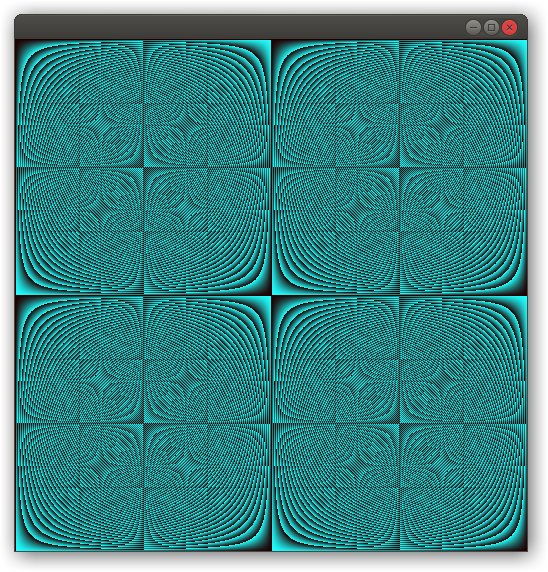

# Эксперименты с X11 на Си и Обероне

*See English below*

## Установка (Дебиан)
```
sudo apt-get install gcc make libx11-dev
```

## Компиляция и запуск
```
cd 1_simplest
make run
```

*Список примеров см. внизу*

-----------

# X11 experiments in C and Oberon

## Setup (Debian)
```
sudo apt-get install gcc make libx11-dev
```

## Compile & Run
```
cd 1_simplest
make run
```

*See the list of examples below*

-----------

## Примеры / Examples

| Имя / Name | Описание / Description |
| --------- | ----------- |
| [1\_simplest](1_simplest/simplest.c) | Создаёт окно. Creates a window. |
| [2\_rectangles](2_rectangles/rectangles.c) | Рисует в окне два чёрных прямоугольника. Draw two black rectangles in a window. |
| [3\_pixmaps](3_pixmaps/pixmaps.c) | Выводит картинку по пикселям. Outputs an image pixel by pixel. |

